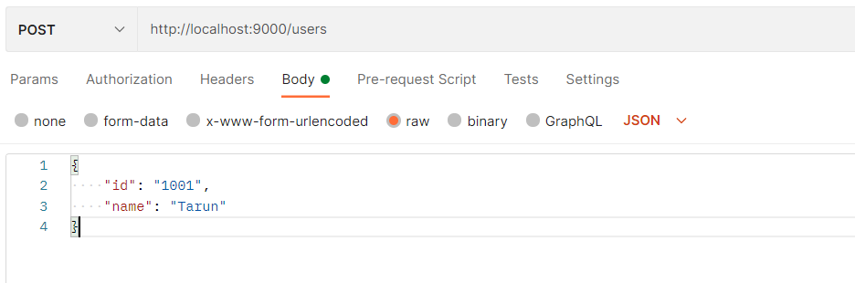
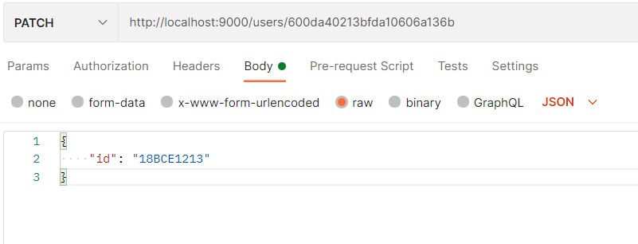

# CRUD_MEN

## Table Of Contents
- [ Introduction ](#Introduction)
- [ Requirements ](#Requirements)
- [ Running the Project ](#Running-the-Project)
- [ Contributors ](#Contributors)


<a name="Introduction"></a>

## Introduction

- An implementation of an user management system
- Crud (Create, Reduce, Update, Delete) operations using express and mongodb
- This project is created as a part of learning Express.js 

<a name="Requirements"></a>

## Requirements

- Install npm modules
```
npm install
```

- Install express using npm
```
npm install express
```

- Install nodemon using npm (Nodemon detects the change in the source code and updates the server)
```
npm install nodemon
```
- MongoDB Atlas

<a name="Running the Project"></a>

## Running the Project

- To start the server

```
nodemon app.js
```
- For returing the total number of users in the database, send a get request to <a href="http://localhost:9000/users">http://localhost:9000/users</a>

- For adding a new user to the database, send a post request to <a href="http://localhost:9000/users">http://localhost:9000/users</a>, with body as follows


- For updating details of a user, send a patch request to http://localhost:9000/users/<user_id></a> with user_id as a prameter and the body as follows


-For deleting a user, send a delete request to http://localhost:9000/users/<user_id> with user_id as a parameter


<a name="Contributors" ></a>

## Contributors

<a href="https://github.com/Tarun0607">Tarun A H </a>